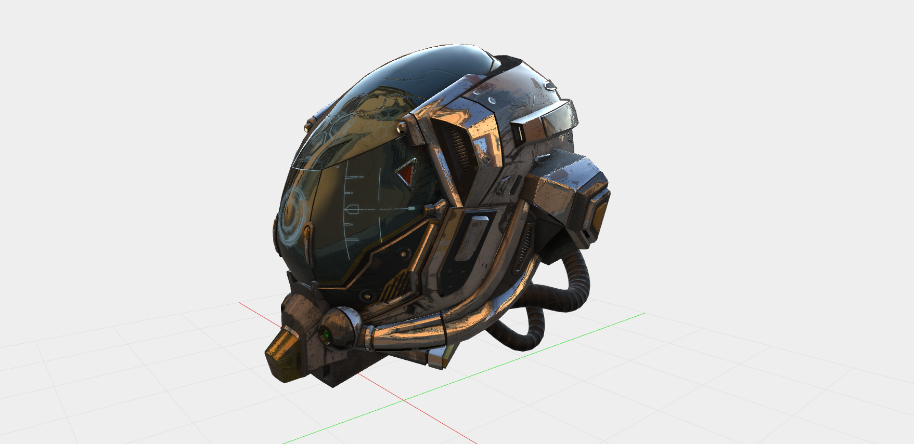

# About the glTF-Loader



The glTF loader enables loading of glTF, glTF Binary, and glTF Drako files into Zea Engine.

This loader is based heavily on the reference glTF loading implementation from the Khronos Group and has been integrated as a plugin for the Zea Engine. As such, the code was modified to align with some of the design goals behind the Zea engine.
https://github.com/KhronosGroup/glTF


Note: the glTF Loader plugin does not support all the various advanced material configurations available in glTF. 
Features such as sheen, clear-coat are not currently supported, as these would first need to be supported by the engine.


## Getting Started

Our recommended way to clone this template is by using [degit](https://github.com/Rich-Harris/degit), a project scaffolding tool.

1. In your HTML page, after the engine script tag, add the script tags to load the Draco decoder (only required for Draco support), and the gltf-loader plugin.

```html
  <script src="https://cdn.jsdelivr.net/npm/@zeainc/zea-engine/dist/index.umd.min.js"></script>

  <script src="https://www.gstatic.com/draco/v1/decoders/draco_decoder_gltf.js"></script>
  <script src="https://cdn.jsdelivr.net/npm/@zeainc/gltf-loader/dist/index.umd.js"></script>
```

2. After creating the scene and renderer, you can instantiate a GLTFAsset class and use that to load glTF files.

```javascript
  const asset = new GLTFAsset('gltf')
  asset.load('url/to/file.gtlf').then(() => {
    console.log('Loading done')
    renderer.frameAll()
  })
  scene.getRoot().addChild(asset)
```

A more fully featured glTF loading sample can be found in this projects GitHub repository. 
https://github.com/ZeaInc/gltf-loader/blob/main/gltf-asset-test.html


## Building and testing the Plugin

  clone the github repository for this project and run the following
```bash
  yarn install
```
  To test out the plugin, run the following.
```bash
  yarn dev
```

## Live demos

The following live demos load glTF assets from the KronosGroup github project directly. You can modify the URL to load your own data.

* [glTF-Draco/Avocado](http://docs.zea.live/gltf-loader/gltf-asset-test.html?gltf=https://github.khronos.org/glTF-Sample-Viewer-Release/assets/models/2.0/Avocado/glTF-Draco/Avocado.gltf)
* [glTF-Draco/Buggy](http://docs.zea.live/gltf-loader/gltf-asset-test.html?gltf=https://github.khronos.org/glTF-Sample-Viewer-Release/assets/models/2.0/Buggy/glTF-Draco/Buggy.gltf&y2zup)
* [glTF/DamagedHelmet](http://docs.zea.live/gltf-loader/gltf-asset-test.html?gltf=https://github.khronos.org/glTF-Sample-Viewer-Release/assets/models/2.0/DamagedHelmet/glTF/DamagedHelmet.gltf&y2zup)
* [glTF/GearboxAssy](http://docs.zea.live/gltf-loader/gltf-asset-test.html?gltf=https://github.khronos.org/glTF-Sample-Viewer-Release/assets/models/2.0/GearboxAssy/glTF/GearboxAssy.gltf&y2zup)
* [glTF/2CylinderEngine](http://docs.zea.live/gltf-loader/gltf-asset-test.html?gltf=https://github.khronos.org/glTF-Sample-Viewer-Release/assets/models/2.0/2CylinderEngine/glTF/2CylinderEngine.gltf&y2zup)
    
## Credits
Khronos® and Vulkan® are registered trademarks, gLTF™ is a trademark of The Khronos Group Inc.
